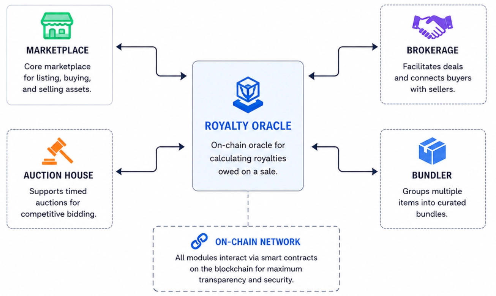
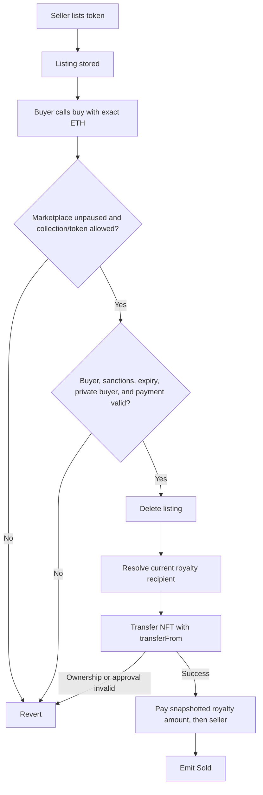
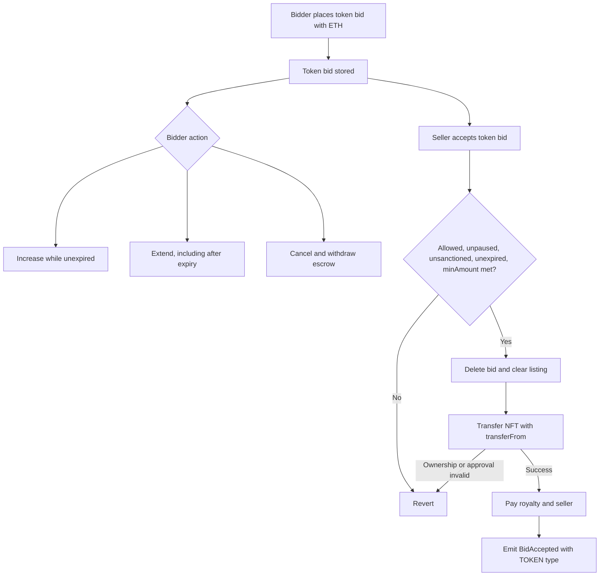
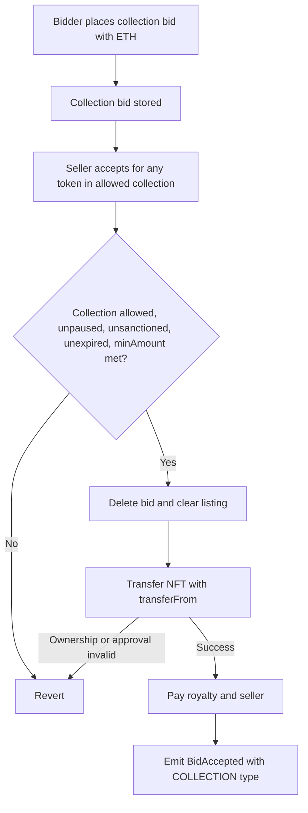
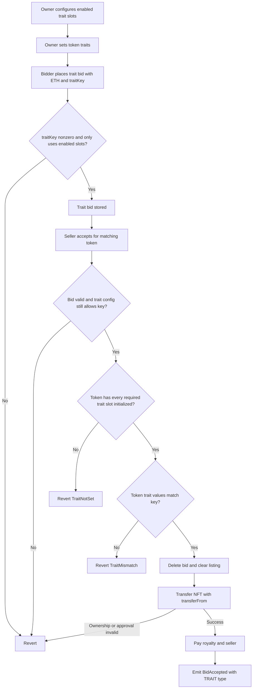

# Luci Market

A bespoke ETH marketplace for trading ERC-721 tokens from Sam Spratt collections. The system supports fixed-price listings, token bids, collection bids, trait-based bids, escrowed ETH offers, sanctions checks, token-level allowlisting for shared contracts, and enforced on-chain royalties through an external royalty model.



## Contracts

- `LuciMarket` in `src/LuciMarket.sol` handles listings, bid escrow, settlement, collection/token allowlists, trait data, pausing, and sanctions checks.
- `LuciRoyaltyModel` in `src/LuciRoyaltyModel.sol` calculates royalties from configured mint prices and holds the royalty recipient.
- `ISanctionsList` in `src/interfaces/ISanctionsList.sol` is the Chainalysis-compatible sanctions interface used by the marketplace.

Both main contracts use `Ownable2Step`. The marketplace owner and royalty model owner may be the same address, but they are separate ownership domains.

## Listings

Token owners can list NFTs for a fixed ETH price. Listings are time-gated with a maximum duration of 180 days and do not escrow the NFT. The token remains in the seller's wallet until purchased. Listing requires the marketplace to be approved for the token so incorrect approval or UI flows fail immediately instead of publishing an already unfulfillable listing. The royalty amount is calculated and stored when the listing is created, locking in the seller's proceeds even if royalty configuration changes later. Calling `list` again for the same token updates or replaces the stored listing, including stale listings left by a previous owner, and snapshots a new royalty amount.

Listings can be public or private. A public listing sets `buyer` to `address(0)` and can be purchased by anyone. A private listing sets `buyer` to a specific address, and only that address can call `buy`.

Listings can be extended in batch while the marketplace is unpaused and the collection or token remains allowed. Extension can revive expired listings as long as the stored seller calls it and the new expiration is valid, and it preserves the snapshotted royalty amount. Listings can be delisted at any time, including while the marketplace is paused, after the collection/token has been removed from the allowlist, or while the seller is sanctioned. Delisting does not transfer or release assets, so it does not perform a sanctions check.

If a listed token is transferred outside the marketplace, the listing becomes stale. Approval can also be revoked after listing. At settlement, the ERC-721 `transferFrom` call enforces that the stored seller currently owns the token and that the marketplace is currently approved. A stale or approval-blocked listing can become executable again if the original seller reacquires or re-approves the token before expiry, so frontends and indexers should filter stale listings.

## Offers

There are three bid types. Each bid escrows ETH when placed and stores an amount plus an expiration timestamp. `expiresAt == 0` means no expiry; otherwise a bid is fillable through the exact expiration timestamp and expires once `block.timestamp > expiresAt`.

- **Token bid**: a bid on a specific token.
- **Collection bid**: a standing bid for any token in an allowed collection.
- **Trait bid**: a standing bid for any token in an allowed collection that matches a trait key.

A bidder can hold one stored bid per type per collection, token, or trait key as applicable. Expired bids still occupy their key until the bidder cancels them or extends them. Bids can be increased while unexpired, extended even after expiry, or canceled while expired. Increasing and extending require the marketplace to be unpaused and the relevant collection or token to be allowed.

Bid placement, increases, and acceptance use a unified `BidSelector` API. The selector's `bidType` determines whether `tokenId` identifies a token bid, `collection` identifies a collection bid, or `traitKey` identifies a trait bid. When accepting any bid, `tokenId` identifies the NFT being sold. Each placement or increase funds exactly one bid; only extension and cancellation support batching. Bid lifecycle logs use the generic `BidPlaced`, `BidIncreased`, `BidExtended`, `BidCanceled`, and `BidAccepted` events, with `bidType`, `collection`, and `bidder` indexed.

Bid acceptance includes a `minAmount` parameter to protect the seller from accepting less than expected if the bid changes before the seller's transaction executes. Accepted bids are deleted, and accepting any bid for a token clears that token's existing listing to avoid leaving a stale listing behind.

Bid cancellation is available while the marketplace is paused or unpaused and does not require the collection to remain allowed. Cancellation is blocked while the bidder is sanctioned; once the bidder is no longer sanctioned, the bidder can cancel and withdraw escrowed ETH.

## Order Flows

The diagrams below are documentation-only summaries of the contract flow. The Solidity source remains the authority.

### Listing Purchase



### Token Bid



### Collection Bid



### Trait Bid



## Collection And Token Allowlisting

The marketplace supports two allowlist modes:

- **Allowed collections**: full collection support. Tokens in an allowed collection can be listed, bought, bid on with token bids, bid on with collection bids, and bid on with trait bids.
- **Allowed tokens**: token-level support for shared contracts. An individually allowed token can be listed, bought, and bid on with token bids, but it is not eligible for collection bids or trait bids.

Removing a collection or token blocks new orders, extensions, and fulfillment for that collection or token, but it does not delete existing listings or escrowed bids. Users can still delist without a sanctions check. Bid cancellation remains subject to sanctions checks because it returns escrowed ETH. If a collection or token is later allowed again, unexpired orders can become executable again unless users have removed them.

## Royalty Model

Royalties are calculated by `LuciRoyaltyModel` from a configured mint price. The marketplace calls:

```solidity
calculateRoyalty(collection, tokenId, salePrice)
```

The royalty model returns the royalty recipient and the royalty amount. Before paying a positive royalty, the marketplace checks that the recipient is not sanctioned, then pays royalties before paying seller proceeds. Listings snapshot the royalty amount when created but resolve the current recipient from the marketplace's current royalty model when purchased. Changing the royalty recipient or replacing the marketplace royalty model therefore changes where an existing listing's snapshotted royalty is paid without changing the seller's proceeds. Bids resolve both values when accepted.

### Configuration

The royalty model owner can:

- Set the royalty recipient.
- Configure a collection mint price.
- Override the mint price for a specific token.

Token overrides take precedence over collection configuration when the token override is enabled. A zero address royalty recipient is rejected in both the constructor and setter.

### Formula

Constants:

```solidity
BASIS = 10_000
MAX_ROYALTY_BPS = 1_000 // 10%
```

The effective mint price is:

1. `tokenOverrides[collection][tokenId].mintPrice` when the token override is enabled.
2. Otherwise `collections[collection].mintPrice`.
3. Otherwise `0`.

Royalty behavior:

| Scenario | Royalty |
| --- | --- |
| `salePrice <= mintPrice` | 0 |
| `salePrice >= mintPrice * 2` | 10% of sale price |
| `mintPrice < salePrice < mintPrice * 2` | Sliding scale from 0% to 10% |
| Unconfigured collection/token and positive sale price | 10% of sale price |

For the sliding-scale range:

```solidity
profit = salePrice - mintPrice;
royalty = Math.mulDiv(salePrice, profit * MAX_ROYALTY_BPS, mintPrice * BASIS);
```

Unconfigured collections intentionally default to `mintPrice == 0`, which charges full royalties for any positive sale price. A configured collection or enabled token override with a zero mint price has the same positive-sale behavior. The marketplace owner controls which collections and tokens can trade, so royalty readiness is an operational allowlist decision.

## Trait Bidding System

The trait bidding system allows bidders to place offers on tokens matching specific trait combinations. It uses a compact `uint32` for token traits and a `uint256` for trait bid keys.

### Token Trait Encoding (`uint32`)

Each token's traits are stored as four 8-bit slots:

```text
[ Trait 3 ][ Trait 2 ][ Trait 1 ][ Trait 0 ]
```

Each 8-bit slot is:

```text
bit 7      initialized flag
bit 6      reserved
bits 5-0   value index, 0-63
```

A trait slot with bit 7 unset cannot satisfy a trait bid. This prevents tokens with partially configured traits from matching bids that reference unconfigured slots.

Example:

- Trait 0 = value `5`, initialized: `0x85`
- Trait 1 = value `12`, initialized: `0x8C`
- Trait 2 = unused: `0x00`
- Trait 3 = unused: `0x00`

Encoded token traits: `0x00008C85`

### Trait Key Encoding (`uint256`)

A trait key is four packed 64-bit bitmaps:

```text
[ Trait 3 bitmap ][ Trait 2 bitmap ][ Trait 1 bitmap ][ Trait 0 bitmap ]
```

Each bitmap represents acceptable values for that trait slot. Bit `N` means value `N` is acceptable.

Matching semantics:

- Within a bitmap, values are ORed.
- Across non-zero bitmaps, slots are ANDed.
- A zero bitmap is a wildcard for that slot.
- A required token trait slot without bit 7 set reverts with `TraitNotSet`.
- A required token trait slot with a non-matching value reverts with `TraitMismatch` when the bid is accepted.

A trait key of `0` is rejected because it is equivalent to a collection bid.

### Trait Matching Diagram

Trait bids are easiest to read as four independent filters. Each non-zero filter must match the token's corresponding initialized trait slot.

```text
traitKey uint256

| bits 255..192      | bits 191..128      | bits 127..64       | bits 63..0         |
| Trait 3 bitmap     | Trait 2 bitmap     | Trait 1 bitmap     | Trait 0 bitmap     |
| wildcard if zero   | wildcard if zero   | acceptable values  | acceptable values  |
```

Example bid:

```text
Trait 0 bitmap: accepts value 5 or 9   = 0x0000000000000220
Trait 1 bitmap: accepts value 12       = 0x0000000000001000
Trait 2 bitmap: wildcard               = 0x0000000000000000
Trait 3 bitmap: wildcard               = 0x0000000000000000

traitKey =
| 0x0000000000000000 | 0x0000000000000000 | 0x0000000000001000 | 0x0000000000000220 |
```

Matching token:

```text
tokenTraits uint32 = 0x00008C85

| Trait 3 slot | Trait 2 slot | Trait 1 slot | Trait 0 slot |
| 0x00         | 0x00         | 0x8C         | 0x85         |
| ignored      | ignored      | init, 12     | init, 5      |
```

Matching result:

```text
Trait 0: key requires 5 OR 9; token has initialized 5   -> match
Trait 1: key requires 12; token has initialized 12       -> match
Trait 2: key is zero                                    -> wildcard
Trait 3: key is zero                                    -> wildcard

Final result: match, because every non-zero bitmap matched.
```

The same bid would fail if Trait 0 were initialized to value `4`, because value `4` is not in the Trait 0 bitmap. It would revert with `TraitNotSet` if Trait 0's initialized bit were unset.

### Collection Trait Configuration

Each collection has a `uint32` trait configuration that mirrors the token trait layout. Only bit 7 of each 8-bit segment matters. If bit 7 is set, that trait slot is enabled for the collection.

When placing, increasing, or accepting a trait bid, the marketplace validates that the trait key does not specify non-zero bitmaps for disabled trait slots. Updating a collection's trait configuration can therefore make existing trait bids unfillable until the bidder cancels or the configuration changes again.

## Sanctions Checks

The marketplace can be configured with a Chainalysis-compatible sanctions list. If `sanctionsList` is `address(0)`, sanctions checks are disabled.

When a sanctions list is configured:

- Sanctioned users cannot list, extend listings, buy, place bids, increase bids, extend bids, cancel bids, or accept bids.
- Sanctioned sellers can delist because deleting a listing does not transfer or release assets.
- Buyers are checked in `buy`.
- Listing sellers are checked in `buy`.
- Sellers and bidders are checked when bids are accepted.
- Royalty recipients are checked at settlement when the royalty amount is greater than zero.
- Bid escrow remains in the contract while a bidder is sanctioned. The bidder can cancel and withdraw only after removal from the sanctions list.

The marketplace owner can update the sanctions list address.

## Pause Behavior

When paused:

- New listings, listing extensions, purchases, bid placements, bid increases, bid extensions, and bid acceptances are blocked.
- Delisting remains available without a sanctions check.
- Bid cancellation remains available, subject to sanctions checks.

Pausing does not delete orders or refund escrow automatically.

## Access Control

The marketplace owner manages:

- Collection allowlist.
- Token allowlist for shared contracts.
- Trait configuration.
- Token trait data.
- Pause state.
- Royalty model address.
- Sanctions list address.

The royalty model owner manages:

- Royalty recipient.
- Collection mint price configuration.
- Token mint price overrides.

Owner-managed trait data is trusted. The marketplace does not derive traits from token metadata or validate trait values beyond the compact encoding rules used for matching.

## Known Limitations

- **Non-escrowed listings**: listed NFTs remain in seller wallets.
- **Stale listings**: listings are not automatically invalidated when NFTs transfer outside the marketplace.
- **ETH only**: ERC-20 payments are not supported.
- **No partial fills**: each accepted bid is consumed in full.
- **One stored bid per key**: bidders can hold one collection bid per collection, one token bid per token, and one trait bid per trait key. Expired bids still occupy storage until canceled or extended.
- **Four trait slots**: trait matching supports four slots with 64 possible values each.
- **Indexed reads required**: active offers are spread across bidder-keyed mappings and are not enumerable on-chain.

## Known Tradeoffs

- **Full royalty fallback**: unconfigured royalty entries default to full royalties for positive sale prices instead of reverting.
- **User-managed stale orders**: users, frontends, and indexers are expected to manage stale listings and stale bids. Fulfillment paths re-check ownership, approval, allowlist status, trait validity, expiration, sanctions status, and payment amount.
- **Re-approved orders can reactivate**: removing a collection or token blocks fulfillment while removed, but existing unexpired orders can become executable again if allowlisted later.
- **Fixed-gas ETH transfers**: ETH payouts use `call` with `100_000` gas. This supports normal EOAs and many smart wallets while bounding recipient execution, but recipients requiring more gas can cause their own payout path to revert.
- **Current royalty recipient availability**: existing listings pay their snapshotted royalty amount to the recipient returned by the current royalty model. If that recipient cannot accept ETH within the fixed gas cap, settlement reverts.
- **Allowed collection trust**: settlement uses `transferFrom` and assumes allowed ERC-721 collections behave correctly.

## Security Considerations

- **Reentrancy**: external state-changing functions use `ReentrancyGuardTransient`. State changes happen before external calls.
- **Contract buyers**: NFT transfers use `transferFrom`, so settlement does not call `onERC721Received`. Contract buyers are responsible for ensuring they can manage received NFTs.
- **ETH payouts**: failed ETH sends revert settlement or cancellation. Contract sellers, bidders, or royalty recipients should be able to receive ETH within the gas cap.
- **Sanctioned escrow**: sanctioned bidders cannot withdraw bid escrow until no longer sanctioned.
- **Owner trust**: owners can pause trading, change allowlists, set traits, change the royalty model, change sanctions enforcement, and configure royalties.

## Indexing Considerations

The indexing layer should enrich on-chain events into a queryable model. Key responsibilities:

- Track listing state and current token ownership.
- Hide listings where the stored seller no longer owns the token.
- Optionally mark stale listings as active again if the original seller reacquires the token before expiry.
- Aggregate token, collection, and trait bids for token and collection pages.
- Resolve compact trait indices into human-readable trait names and values.
- Track sanctions and allowlist changes that affect order executability.

On-chain bid data is keyed by bidder address, so event indexing is required for practical offer discovery.
