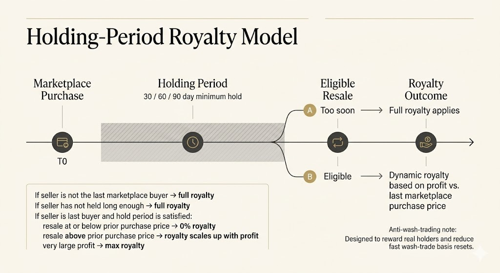

# Sam Spratt Marketplace
 
A bespoke marketplace for trading ERC-721 tokens from Sam Spratt's collections. Supports listings, token bids, collection bids, and trait-based bids — all with escrowed ETH and enforced on-chain royalties.
 
## Listings
 
Token owners can list their tokens for sale at a fixed price. Listings are time-gated with a maximum duration of 180 days and do not escrow the NFT — the token remains in the seller's wallet until purchased.

Listings can be public or private. A public listing sets `buyer` to `address(0)` and can be purchased by anyone. A private listing sets `buyer` to a specific address, and only that address can call `buy`.
 
Listings can be extended individually or in batch while the marketplace is unpaused and the collection is allowed. Listings can be delisted at any time, including when the marketplace is paused.
 
If a listed token is transferred outside the marketplace, the listing becomes stale. The new owner can override it by creating a new listing. The `buy` function verifies the seller still owns the token at execution time.
 
## Offers
 
There are three types of offers, each escrowing ETH on placement:
 
- **Token Bid** — a bid on a specific token in a collection.
- **Collection Bid** — a standing bid for any token in a collection.
- **Trait Bid** — a bid for any token matching a set of trait criteria.
 
A bidder can hold one active bid per type per collection (and per token/traitKey as applicable). Bids can be increased or extended while the marketplace is unpaused and the collection is allowed. Cancellation is always permitted, even when the marketplace is paused or the collection has been removed, and returns escrowed ETH.
 
When a seller accepts a bid, they pass a `minAmount` parameter to protect against frontrunning (e.g., a bidder reducing their bid between the seller's transaction submission and execution).
 
## Dynamic Royalties
 
Royalties are calculated dynamically based on profit relative to the last recorded marketplace sale. The marketplace records the buyer, sale price, and timestamp for each successful marketplace sale.


 
| Scenario | Royalty |
|---|---|
| No prior sale recorded, or seller ≠ last buyer | 10% of sale price |
| Sale at or below last price (breakeven/loss) | 0% |
| Sale before the collection hold period has elapsed | 10% of sale price |
| Sale between 1× and 2× last price after the hold period | Linear scale from 0% to 10% applied to sale price |
| Sale at 2× or more last price | 10% of sale price |
 
This incentivizes trading through the marketplace by rewarding repeat participants with reduced royalties when profits are modest.

### Holding Period

Each collection has a minimum hold period for scaled royalties. When a collection is added, its hold period defaults to 30 days. The owner can update this per collection, capped at 180 days.

If the seller is the last recorded marketplace buyer but has not held the token for the collection's configured hold period, any profitable resale pays the full 10% royalty. Once the hold period has elapsed, profitable resales below 2x the last marketplace price use the sliding scale.

### Sliding Scale Formula

For profitable resales after the hold period where `salePrice < lastPrice * 2`, royalties are calculated with full-precision `Math.mulDiv`:

```solidity
royalty = Math.mulDiv(salePrice, profit * MAX_ROYALTY_BPS, lastPrice * BASIS);
```

where `profit = salePrice - lastPrice`, `MAX_ROYALTY_BPS = 1000`, and `BASIS = 10_000`.

This preserves simple accounting around the latest marketplace buyer and sale price while charging full royalties during short holding windows and on 2x-or-greater resales.

### Royalty Tradeoffs

The marketplace intentionally uses the latest marketplace sale as the token's cost basis. This keeps royalty accounting simple and fully on-chain, but it cannot distinguish an arm's-length purchase from a sale between related wallets. The collection hold period is the primary mitigation: if the last marketplace buyer resells before the configured hold period elapses, the resale pays the full 10% royalty.

After the hold period has elapsed, the latest marketplace buyer qualifies for scaled royalties according to the normal formula. This is an accepted tradeoff of the dynamic royalty model rather than a condition the contract attempts to classify on-chain.

## Trait Bidding System

The trait bidding system allows bidders to place offers on tokens matching specific trait combinations. It uses a compact, gas-efficient encoding that fits entirely within native EVM word sizes — a `uint32` for token traits and a `uint256` for trait bid keys — enabling single-SLOAD lookups and pure bitwise matching with no loops over dynamic arrays, no hashing, and no calldata overhead.

### Token Trait Encoding (`uint32`)

Each token's traits are stored as a single `uint32` value, divided into four 8-bit segments:

```
┌─────────────────┬─────────────────┬─────────────────┬─────────────────┐
│ Trait 3 [31:24] │ Trait 2 [23:16] │  Trait 1 [15:8] │  Trait 0 [7:0]  │
└─────────────────┴─────────────────┴─────────────────┴─────────────────┘
```

Each 8-bit segment is structured as:

```
┌───┬───┬─────────────────────────┐
│ 7 │ 6 │   5   4   3   2   1   0 │
├───┼───┼─────────────────────────┤
│ I │ — │      Value (0–63)       │
└───┴───┴─────────────────────────┘
```

| Bit(s) | Name        | Description                                                                                  |
|--------|-------------|----------------------------------------------------------------------------------------------|
| 7      | Initialized | `1` = this trait slot is active for the token. `0` = uninitialized.                          |
| 6      | Reserved    | Unused. Should be `0`.                                                                       |
| 5–0    | Value       | The trait value index (0–63). Used to look up the corresponding bit in the trait key bitmap. |

A trait slot with bit 7 unset cannot be used to satisfy a trait bid. This prevents tokens with partially configured traits from matching bids that reference unconfigured slots.

#### Example

A token with:
- Trait 0 = value `5`, initialized → `0b10000101` = `0x85`
- Trait 1 = value `12`, initialized → `0b10001100` = `0x8C`
- Trait 2 = not used → `0x00`
- Trait 3 = not used → `0x00`

Encoded as: `0x00008C85`

### Trait Key Encoding (`uint256`)

A trait key encodes the bidder's desired trait criteria as four 64-bit bitmaps packed into a single `uint256`:

```
┌──────────────────────┬──────────────────────┬──────────────────────┬──────────────────────┐
│ Trait 3 Bitmap       │ Trait 2 Bitmap       │ Trait 1 Bitmap       │ Trait 0 Bitmap       │
│ [255:192]            │ [191:128]            │ [127:64]             │ [63:0]               │
└──────────────────────┴──────────────────────┴──────────────────────┴──────────────────────┘
```

Each 64-bit bitmap represents the acceptable values for that trait slot. Bit `N` being set means value `N` is acceptable.

#### Matching Semantics

- **Within a single bitmap (OR):** The bidder accepts *any* of the set values for that trait. If bits 3 and 7 are set, the bidder wants tokens with trait value 3 **or** 7.
- **Across bitmaps (AND):** All non-zero bitmaps must match. If bitmaps for trait 0 and trait 1 are non-zero, the token must satisfy *both*.
- **Wildcard (zero bitmap):** A bitmap of `0` means "don't care" — that trait slot is ignored during matching.

#### Example

A bidder wants tokens where:
- Trait 0 is value 2 or value 5
- Trait 1 is value 12
- Trait 2 and 3 are wildcards (any value accepted)

```
Trait 0 bitmap: bit 2 and bit 5 set   → 0x0000000000000024  (binary: ...00100100)
Trait 1 bitmap: bit 12 set            → 0x0000000000001000  (binary: ...1000000000000)
Trait 2 bitmap: wildcard               → 0x0000000000000000
Trait 3 bitmap: wildcard               → 0x0000000000000000
```

Encoded trait key:
```
0x0000000000000000_0000000000000000_0000000000001000_0000000000000024
```

### Collection Trait Configuration (`uint32`)

Each collection has a trait configuration that mirrors the token trait layout. It defines which of the four trait slots are active for that collection.

```
┌─────────────────┬─────────────────┬─────────────────┬─────────────────┐
│  Slot 3 [31:24] │  Slot 2 [23:16] │   Slot 1 [15:8] │   Slot 0 [7:0]  │
└─────────────────┴─────────────────┴─────────────────┴─────────────────┘
```

Only bit 7 of each segment matters — if set, that trait slot is enabled for the collection. The remaining bits are reserved.

### Validation

When placing or increasing a trait bid, the contract validates that the trait key does not specify non-zero bitmaps for disabled trait slots. This prevents bidders from locking additional ETH into bids that cannot be filled under the current collection configuration.

When accepting a trait bid, the contract revalidates the trait key against the current collection configuration before checking token traits. Updating a collection's trait configuration can therefore block fills for existing trait bids that target now-disabled trait slots. Those bids are not automatically deleted; bidders can still cancel them and recover escrowed ETH.

A trait key of `0` (all wildcards) is also rejected, as it would match every token and is functionally equivalent to a collection bid.

### Matching Algorithm

When a seller accepts a trait bid, the contract first confirms the collection is still allowed and the trait key is still valid for the current collection configuration. It then runs the following matching check:

```
For each trait slot (0–3):
  1. Extract the 64-bit bitmap from the trait key
  2. If the bitmap is 0, skip (wildcard)
  3. Extract the 8-bit trait from the token's trait data
  4. If bit 7 (initialized) is not set, revert — the trait is not configured
  5. Extract the value index from bits 0–5
  6. Check if the bitmap has bit `value_index` set
  7. If not, the token does not match

If all non-wildcard bitmaps pass, the token matches the bid.
```

This is implemented as a tight loop of bitwise operations with no external calls, no storage reads beyond the initial token trait SLOAD, and no dynamic memory allocation.

### Gas Characteristics

| Operation           | Key Cost Driver                          |
|---------------------|------------------------------------------|
| Place trait bid     | Collection allowlist/config reads + 1 SSTORE (bid) |
| Increase trait bid  | Collection allowlist/config reads + bid update |
| Accept trait bid    | Collection allowlist/config reads + 1 SLOAD (bid) + 1 SLOAD (token traits) + bitwise matching |
| Trait matching      | Pure computation — no external calls |

The matching function is `O(1)` with a fixed 4-iteration loop over constant-size data, making gas costs predictable regardless of how many trait values or combinations are specified in the bid.

## Access Control
 
The marketplace owner (via `Ownable2Step`) manages:
 
- **Collection whitelist** — only approved collections can list, buy, place bids, increase bids, extend orders, or accept bids. Removing a collection does not delete existing listings or bids, but it blocks their fulfillment and extension until the collection is allowed again. Delisting and bid cancellation remain available.
- **Collection hold period** — setting the minimum time a last marketplace buyer must hold a token before qualifying for scaled royalties. New collections default to 30 days and can be configured up to 180 days.
- **Trait configuration** — setting which trait slots are active for trait bids in a collection. Trait keys are validated when placing, increasing, and accepting trait bids, so disabling a trait slot blocks fills for existing bids using that slot.
- **Token traits** — batch-setting trait data for tokens. This is a privileged function with no on-chain validation of trait values against the collection config; the owner is trusted to provide correctly encoded data.
- **Royalty recipient** — the address receiving royalty payments.
- **Pause state** — when paused, only delisting and bid cancellation are permitted.

## Known Limitations
 
- **4 trait categories, 64 values each** — the encoding is fixed at four trait slots with 6 bits of value space per slot. Collections requiring more granularity would need a contract upgrade.
- **One bid per type per bidder** — a bidder can only hold one collection bid, one trait bid per traitKey, and one token bid per tokenId per collection. To bid on multiple trait combinations, a bidder places separate bids with different traitKeys.
- **Centralized trait management** — trait data is set by the contract owner, not derived from on-chain metadata or token URIs. Trait accuracy depends on the owner correctly encoding and updating values.
- **ETH only** — the marketplace does not support ERC-20 tokens for payments or bids.
- **No partial fills** — bids are all-or-nothing. A bid is fully consumed when accepted.
 
## Known Tradeoffs

- **Latest-sale royalty basis** — dynamic royalties use the latest marketplace buyer, sale price, and timestamp as the on-chain cost basis. The contract charges full royalties during the configured hold period, then allows scaled royalties after that period without trying to infer whether wallets are related.
- **User-managed stale orders** — the contract does not automatically cancel listings or bids when external conditions change, including token transfers, trait configuration changes, collection removal, or later collection re-approval. Sellers can delist, bidders can cancel, and fulfillment paths re-check current ownership, approvals, collection allowlist status, trait validity, expiration, and payment amounts at execution time.
- **Re-approved collections can reactivate orders** — removing a collection blocks fulfillment and extension, but it does not delete existing listings or escrowed bids because doing so would require canceling user orders or refunding bidder escrow on their behalf. If the collection is later allowed again, unexpired orders can become executable again unless users have canceled or delisted them.
 
## Security Considerations
 
- **Reentrancy** — the contract uses `ReentrancyGuardTransient` (transient storage-based) to prevent reentrancy across all external functions. All state mutations occur before external calls (checks-effects-interactions pattern).
- **`safeTransferFrom` callback** — NFT transfers use `safeTransferFrom`, which invokes `onERC721Received` on the buyer if the buyer is a contract. This is a potential reentry vector, but is mitigated by the transient reentrancy guard and the fact that all state changes (bid deletion, listing clearing, sale recording) complete before the transfer.
- **ETH forwarding** — ETH transfers use low-level `call` with all available gas. This allows recipients to be contracts (e.g., multisigs, smart wallets) but means a malicious royalty recipient or seller could consume gas. The reentrancy guard prevents state manipulation.
- **Stale listings** — listings are not invalidated on-chain when a token is transferred. The `buy` function checks ownership at execution time, but the listing remains in storage and can become executable again if the original seller reacquires the token before expiry. Frontends and indexers should filter stale listings.
- **Allowlist removal** — removing a collection blocks fulfillment and extension of existing orders but does not delete them. This preserves user custody over listings and bid escrow, and means re-allowing a collection can make unexpired orders executable again.
- **Owner trust assumptions** — the owner can set arbitrary trait data, configure collection hold periods, pause the marketplace, and change the royalty recipient. Users trust the owner to act honestly. `Ownable2Step` mitigates accidental ownership transfers.
 
## Indexing Considerations
 
The indexing infrastructure is best served by a REST API that enriches on-chain event data into a queryable data model. Key responsibilities:
 
- **Listing invalidation on transfer** — when a token is transferred outside the marketplace, mark the listing as invalidated unless the token is transferred back to the original seller and the listing has not expired.
- **Offer aggregation** — aggregate all active bids (token, collection, and trait) for a given token or collection into a single queryable view.
- **Trait resolution** — map on-chain trait indices to human-readable trait names and values for frontend display.
 
A subgraph is insufficient for this — the transfer-aware invalidation logic and enriched data views require a traditional backend.
 
## Frontend Considerations
 
### Token Pages
 
Read listing data directly from the blockchain using Multicall3 to batch-query the listing state and current token owner in a single RPC call. If the listing seller does not match the current owner, hide the listing.
 
Use the backend indexer for offer data. On-chain bid data is spread across three separate mappings keyed by bidder address, making it impractical to enumerate all bids for a given token without indexed events.
 
### Collection Pages
 
Use the indexer for both listings and collection-level offers. The on-chain data structure is optimized for write-path efficiency (accepting/canceling specific bids), not for read-path enumeration across all bidders.
